# Systemwide Architecture

This document reviews the current `crates/systemwide` architecture and records a
direction for making state ownership clearer and the system easier to debug
without installing the macOS HAL package for every test cycle.

## Maintenance Policy

`ARCHITECTURE.md` is a maintained project document, not a one-time review
artifact. Keep it current with the same discipline as the systemwide `README`
and project changelog.

Update this document whenever a change affects:

- component responsibilities or process boundaries;
- state ownership, desired/applied state, or shared-memory protocol fields;
- user-visible runtime flows such as startup, playback, plugin loading, key
  rotation, device recovery, installation, or upgrades;
- debugging, test strategy, or manual recovery procedures;
- safety invariants around CoreAudio, real-time callbacks, physical output
  device selection, encryption, or installer lifecycle.

## Scope

`systemwide` is the SOTF subsystem that captures operating-system audio,
processes it through the SOTF plugin engine, and sends the processed signal to a
physical output device. On macOS the capture side is a CoreAudio HAL virtual
device. Other platforms currently fall back to a `NullDriver` while keeping the
same daemon-facing driver abstraction.

The current code is split into four major surfaces:

| Component | Location | Responsibility |
| --- | --- | --- |
| Configbar toolbar | `crates/daemon/configbar/src/*.swift` | macOS menu bar app, daemon lifecycle, user commands, plugin rack UI, metering UI, hardware-device recovery polling, menu bar status icon |
| Daemon | `crates/daemon/bin/sotf_daemon.rs` | IPC server, command authorization, playback lifecycle, plugin-chain orchestration, output device choice, encryption commands |
| Driver abstraction | `crates/driver-common/src/lib.rs` | Cross-platform single-owner `AudioDriver` trait, `DriverStatus`, `DriverConfig`, `ConfigResult`, `DriverError`, `NullDriver` fallback |
| macOS HAL bridge | `crates/driver-hal/src/*`, `crates/driver-hal/swift/Sources/*` | Shared-memory protocol, encrypted audio records, CoreAudio HAL driver implementation, Rust `HalDriver` adapter |
| Installer scripts | `scripts/build-systemwide.sh` | App bundle, package/DMG build, running-system quiesce, HAL driver replacement, stale runtime cleanup |

The daemon also depends on the workspace audio engine and plugin stack:
`sotf_audio::manager::AudioEngineManager`, `sotf-engine`, and `sotf-plugins`.

## Review Hardening Status

The July 2026 systemwide review follow-up tightened the existing macOS and
cross-platform fallback paths without claiming new native Linux or Windows
capture drivers:

- Daemon startup acquires process-lifetime ownership locks for every selected
  runtime resource: the control socket, HAL shared-memory file, HAL-readable
  key copy, and daemon-private key. Canonicalized lock paths are sorted and
  deduplicated before acquisition. The winning process owns the complete
  transport before stale-socket handling or encryption-key rotation, so a
  second daemon cannot disturb an active transport merely by selecting a
  different control socket.
- The daemon owns startup key rotation. Every daemon lifetime starts with a
  fresh AEAD key before shared-memory audio begins, which makes resetting the
  frame counter safe; the mmap layer no longer rotates keys behind
  `KeyManager`'s cached state.
- The daemon's per-client handlers remain synchronous because they call
  synchronous engine and driver APIs. Their threads and socket clones are
  retained, completed handlers are reaped, and shutdown closes every retained
  socket and joins every handler before process exit. Configbar dispatches all
  mutations through a serial background queue so UI actions never block the
  main thread. Status and metering polls share one reconnecting JSON-line
  connection rather than creating a daemon thread for every poll. The unused
  Tokio runtime was removed, and immutable available-plugin metadata is cached
  once per process.
- The shared-memory protocol is version 6. Geometry changes use a requested
  channel count plus a quiesce/ack handshake. The atomic `configuring` word is
  also a commit bitset: bit 0 blocks new IO commits, while bits 1 and 2 reserve
  the reader and writer cursor publications. Both Rust and Swift claim the
  relevant bit immediately before publishing a cursor; reconfiguration waits
  for those bits and aborts without changing geometry if the bounded wait
  expires. Reads and writes are frame-aligned and never expose a partially
  published interleaved frame.
- Pipeline mutations are serialized across IPC clients and apply failures roll
  back to the last applied plan when possible. Rollback explicitly restores
  the previous plan's HAL input geometry even when the pre-transition driver
  snapshot is stale after a successful channel-count request.
  A failed transition leaves an explicit recovery diagnostic instead of
  silently claiming that the old audio stream is still live. If both the
  requested apply and restore fail, the
  process-lifetime `pipeline_recovery` state remains set, `engine_ready` stays
  cleared, and status/snapshot responses expose `restart_daemon` as the
  actionable recovery step. The state clears only after a successful apply.
- Every shared header field used across Rust and Swift is accessed atomically.
  Swift uses C11 acquire loads and release stores exposed by
  `BridgingHeader.h`; Rust uses matching atomic types and orderings. Contract
  tests pin the shared-header size and field offsets on both sides.
- The checked-in `driver-hal/shared_memory_layout.json` is the ABI manifest.
  Rust includes and validates it against size, alignment, field count, and
  every field offset; HAL packaging copies the same file into bundle
  resources, and Swift test code loads it from an explicit environment path or
  bundle resource. A source-file-relative fallback is not part of the runtime
  contract.
- Ring capacity is derived from the current atomic geometry rather than a
  process-local cached geometry. Both Swift read and write paths re-check the
  `configuring` gate before publishing ring positions after copying.
- The Swift HAL publishes active channel geometry to `driverDoIOOperation`
  through a C11 atomic snapshot. The CoreAudio IO callback never acquires the
  control-plane `configurationLock`; only successful configuration commits
  update the snapshot, after local ring buffers have been rebuilt.
- The Swift loopback uses one interleaved SPSC ring with C11 acquire/release
  frame cursors. A block is published with one release store after every
  channel has been copied, so consumers cannot observe a partially published
  multichannel frame.
- Encrypted realtime HAL transport is disabled until the Swift side has a
  caller-buffer AEAD implementation. CryptoKit's ChaChaPoly API constructs
  `Data`, nonce, and sealed-box values, so the daemon rejects attempts to enable
  encryption and the default HAL callback build rejects encrypted frames rather
  than violating the allocation-free callback contract. Key observation and
  reload remain maintenance-queue work.
- Both the daemon-private key and HAL-readable key copy are published through
  mode-0600, same-directory temporary files and atomically renamed into place.
  The destination is never removed before replacement, so a raced symlink
  cannot redirect key material; file ownership, type, and mode are verified and
  the parent directory is synced after publication. The second copy is required
  because the sandboxed CoreAudio HAL process cannot read the daemon-private
  path; it contains the same per-session key and is protected by the same
  per-user ownership and publication rules.
- Encryption commands and status expose transport synchronization explicitly:
  `synced`, `pending`, `mismatch`, `unavailable`, or `not_applicable`. A daemon
  key-state change is no longer presented as fully synchronized when the HAL
  mapping is absent or advertises a different fingerprint.
- User-selected audio files must be absolute, same-owner, non-symlink regular
  files between 1 byte and 64 GiB. The daemon canonicalizes and verifies the
  device/inode before handing the path to the engine. Same-UID replacement
  remains inside the per-user trust boundary; this is not a capability grant to
  mutually hostile processes running as the same account.
- `dump_state` publishes bounded operation telemetry for metering and pipeline
  reload commands: request count, total/max latency, largest serialized
  response, and budget-exceed counts. Current diagnostic budgets are 5 ms / 64
  KiB for metering and 1 s / 256 KiB for pipeline reloads.
- Playback tracks logical DSP channels separately from the physical CoreAudio stream layout. If a device advertises only a wider native layout, the engine opens the smallest compatible native stream, maps logical channels to its leading outputs, and zero-fills unused outputs; graph validation and UI channel requirements continue to use the logical count.
- The daemon persists the last successfully applied physical output device in the per-user application-support directory and restores it before cold-start playback. Environment selection remains an explicit override. Missing, invalid, or virtual persisted devices are rejected instead of routing processed audio back into the virtual capture device.
- Configbar enables `SO_NOSIGPIPE` on every daemon socket. A daemon-side close therefore becomes a recoverable `EPIPE`/reconnect result instead of terminating the menu bar process while a configuration mutation is in flight.
- On macOS, the HAL decoder, DSP processing thread, and playback feeder all run in the engine's soft audio-work QoS class. CPAL/CoreAudio alone owns the hardware callback's hard realtime policy; Linux/Windows feeder scheduling is unchanged.
- Audio-path wall-clock heartbeat refresh and default debug tracing were
  removed. Swift IO tracing is available only when `SOTF_AUDIO_TRACE` is
  compiled in.
- Configbar serializes launchd commands, fallback daemon spawning, termination,
  and restart escalation on a utility queue. AppKit state and callbacks return
  to the main queue; `Process.waitUntilExit()` never runs there.
- The installer owns both per-user LaunchAgents: `org.spinorama.sotf-daemon`
  and `org.spinorama.sotf-systemwide`. It replaces both plists, starts the
  daemon immediately, then starts and verifies Configbar after the HAL package
  lands. launchd output is retained under `~/Library/Logs/SotF`; installation
  rolls files at 10 MiB so the preceding run remains available as `.1`.
- The production daemon process is owned by the `org.spinorama.sotf-daemon`
  LaunchAgent (`builds/macos/org.spinorama.sotf-daemon.plist`), registered by
  the installer for the console user with `RunAtLoad` plus `KeepAlive`.
  Quitting the menu bar app releases only monitoring ownership; systemwide
  audio keeps running. Configbar restart actions bounce the daemon through
  `launchctl kickstart`, falling back to a spawned child process only in
  development/lab environments where the agent is not registered. The daemon
  log is appended to, never truncated, so a previous run's history survives
  restarts and intermittent failures remain diagnosable.
- The Configbar watchdog probes IPC health (`isDaemonReachable`) rather than
  only checking child-process liveness, so a hung-but-alive daemon that still
  holds the socket is detected and restarted after two consecutive failed
  probes.

On Linux, the daemon continues to use the cross-platform `NullDriver` unless a
test selects the deterministic lab driver. On Windows, only `driver-common` and
the `NullDriver` contract are currently portable; a Windows APO implementation
remains planned work.

## Component View

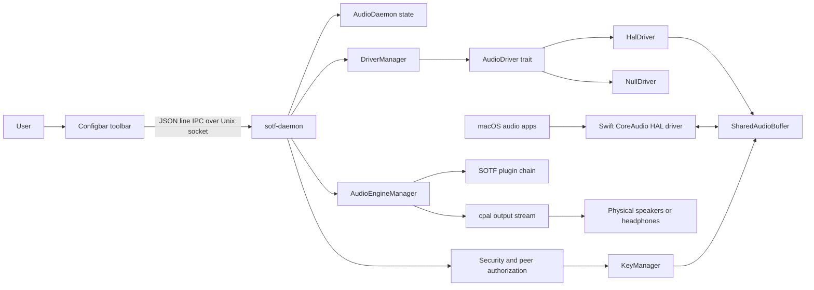

## Static Structure

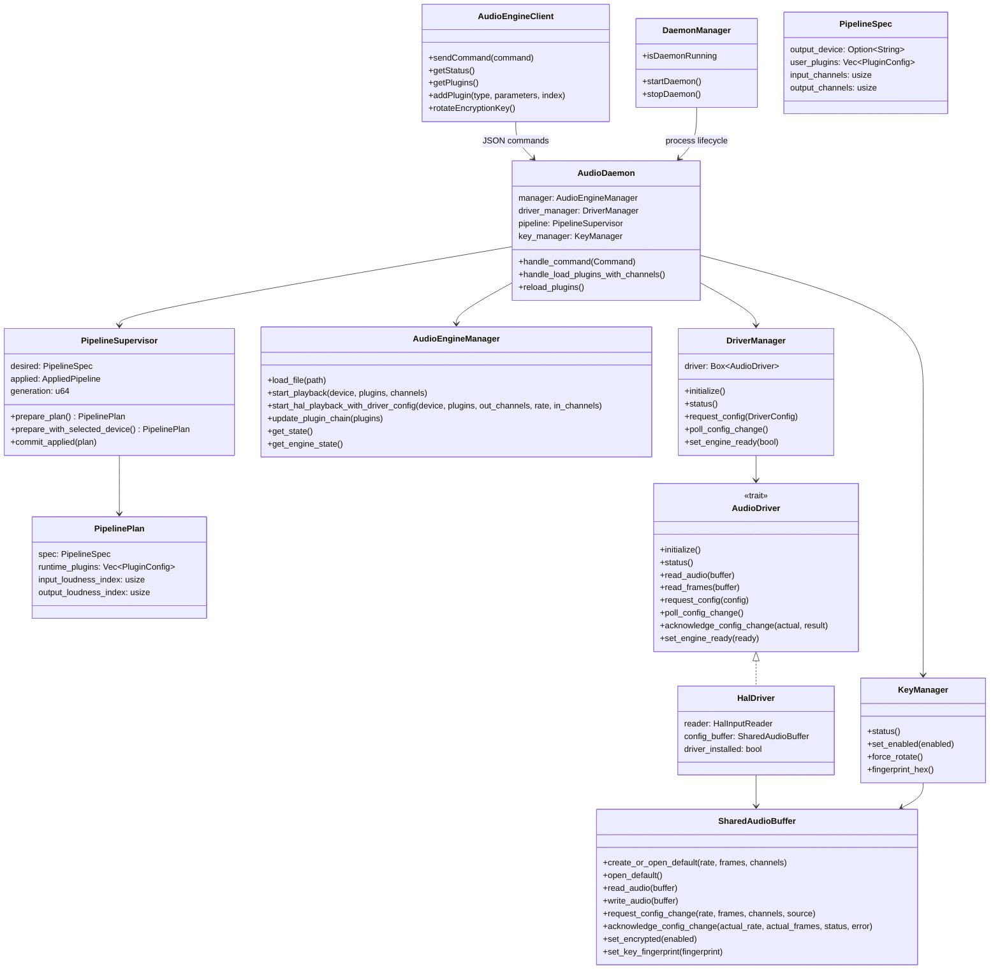

## Runtime Boundaries

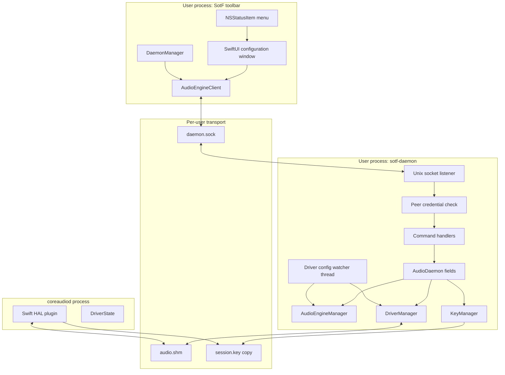

## IPC Model

The daemon exposes one JSON object per line on a Unix domain socket. The secure
path is per-user, with a legacy `/tmp/autoeq_audio.sock` opt-in path still
supported for compatibility. The legacy mode binds that path directly; it is
never represented by a daemon-created symlink. The daemon verifies peer
credentials and classifies callers:

| Peer class | Access |
| --- | --- |
| Owner or root | All commands |
| macOS `_coreaudiod` | Status/config/encryption visibility only |

The command enum currently covers:

- Playback: `load`, `play`, `pause`, `stop`, `seek`, `set_volume`.
- Device and driver config: `list_devices`, `set_device`, `driver_status`,
  `set_input_channels`, `set_output_channels`, `set_pipeline_channels`,
  `set_sample_rate`, `set_buffer_frames`, `apply_configuration`,
  `get_driver_config`.
- Plugin chain: `load_plugins`, `get_plugins`, `get_available_plugins`,
  `add_plugin`, `remove_plugin`, `update_plugin`, `reorder_plugins`.
- Metering: `get_loudness`, `get_metering`.
- Encryption: `set_encryption`, `encryption_status`,
  `rotate_encryption_key`.
- Lifecycle/diagnostics: `status`, `get_snapshot`, `dump_state`, `shutdown`.

## Current State Ownership Review

The first control point added by this branch is `PipelineSupervisor`. It is the
daemon-owned state owner for the user-facing audio graph: selected physical
output device, user plugin list, requested HAL input channels, requested output
channels, applied runtime chain generation, and the metering tap indices derived
from that applied runtime chain.

The important distinction is desired versus applied state:

- `PipelineSpec` is what the daemon wants next.
- `PipelinePlan` is a validated, derived transition: user plugins sanitized,
  loudness monitors injected, channel counts checked, and output device filtered.
- `AppliedPipeline` is committed only after the engine accepts the transition.

This removes the previous independent daemon mutexes for `selected_device`,
`current_plugins`, channel counts, and meter indices.

| State | Current owner or cache | Notes |
| --- | --- | --- |
| Playback engine state, volume, mute, plugin runtime | `AudioEngineManager` | Authoritative for the actual engine stream and cached plugin data. |
| Desired user plugin list | `PipelineSupervisor.desired.user_plugins` | User plugins only; daemon injects input/output loudness monitors when building a `PipelinePlan`. |
| Runtime plugin chain | `PipelinePlan.runtime_plugins`, then `AudioEngineManager` | Derived from desired state and committed to `AppliedPipeline` only after the engine accepts it. |
| Output device selection | `PipelineSupervisor.desired.output_device`, `ConfigurationView.selectedDevice` | Toolbar stores a UI cache; daemon stores and validates the authoritative desired output device. |
| Driver status/config | `DriverManager`, `HalDriver.config_buffer`, shared-memory header, Swift HAL `DriverState` | Status and config are protocol state in shared memory plus local state on both Rust and Swift sides. |
| Input/output channel counts | `PipelineSupervisor.desired`, shared-memory header, toolbar `@State` | Daemon desired channel counts now have one owner; shared memory reports negotiated transport state. |
| Metering indices | `AppliedPipeline.input_loudness_index`, `AppliedPipeline.output_loudness_index`, `AudioEngineManager` plugin cache | Derived from the applied plugin chain and no longer independently mutable. |
| Encryption enabled/fingerprint | `KeyManager`, shared-memory header, Swift toolbar cache, HAL reader/writer cached cipher | `KeyManager` owns the desired key state; shared memory publishes the active transport state. |
| Daemon process lifecycle | Toolbar `DaemonManager`, daemon `running` flag | The toolbar owns only a child it spawned; it probes and adopts launchd/debug daemons without terminating them. For an adopted daemon, the outage action is labeled `Reconnect`; the daemon owner remains responsible for restart. The daemon owns its accept-loop shutdown flag and handles SIGINT/SIGTERM by clearing readiness, stopping the engine, joining the watcher, and removing its socket. |

Command handlers still orchestrate several effects—driver config, engine
restart/hot update, shared-memory encryption sync, and response building—but
the cross-client pipeline mutation mutex now keeps read-modify-apply sequences
atomic. This is still a candidate for a future controller/reducer extraction,
not a reason for clients to replay cached state.

Configbar IPC uses command-specific bounded response deadlines. Read-only
status and metering calls retain a one-second deadline, while synchronous
device and pipeline mutations allow up to five seconds because stopping and
recreating a CoreAudio output stream can legitimately cross one second. This
prevents the toolbar from reporting a failed hardware selection after the
daemon has already committed and started that device.

### State Mutation Audit

Recent live failures were all state-control failures, not isolated DSP bugs:

- The toolbar cached channel counts and could send stale `input_channels` back
  through `load_plugins`, overwriting daemon-negotiated HAL input channels.
- HAL readiness used `engine_ready` plus `daemon_heartbeat_ms`; when the daemon
  stopped refreshing the heartbeat while idle, HAL accepted a later playback
  client but refused to write frames to shared memory.
- Encryption key rotation changed the shared-memory fingerprint while HAL
  reader/writer ciphers were cached, so audio could be present but decode to
  silence until ciphers reloaded.
- The daemon status could report `Playing` while `playback_callback_count` and
  frame counters stayed at zero; the UI did not surface that contradiction as a
  distinct pipeline fault.
- A feedback-loop symptom can occur whenever the physical output sink is not
  controlled as a hardware-only selection distinct from the virtual system
  output.

The current controls are:

| Area | Current mutation path | Missing control |
| --- | --- | --- |
| Desired audio graph | `PipelineSupervisor.prepare_plan()`, reducer-style setters, and `commit_applied()` own normal plugin/channel/device changes. `AudioDaemon::handle_command_at_generation` is the common serialized IPC intent boundary. | Move the remaining effect implementations behind a dedicated controller type; the dispatcher now provides one validation/serialization point but does not yet own every adapter. |
| Toolbar configuration | Swift `@State` mirrors daemon snapshots and sends patch-style channel/device intents or complete plugin artifacts | Configbar synchronizes programmatic state without echoing commands and serializes mutations off the main thread. Remaining UI caches are presentation state, not daemon authority. |
| Driver/HAL transport | `DriverManager` and `SharedAudioBuffer` publish active format, config handshake, readiness, heartbeat, and encryption fingerprint | Shared memory remains both transport and tempting state source. Only `DriverManager`/`HalDriver` should write protocol fields; higher layers should read them through typed status snapshots. |
| Runtime engine | `AudioEngineManager` owns playback state, stream counters, plugin runtime, volume, mute, and cached plugin data. IPC, startup, snapshots, and driver recovery share the `pipeline_mutation` transition boundary. | Move the remaining stop/configure/start/commit effects into one controller method; do not add handler-specific transaction implementations. |
| Metering | Loudness monitor indices are derived from `AppliedPipeline`; data comes from the engine plugin cache. `get_metering` publishes source provenance plus the control generation and Configbar rejects samples from another pipeline generation. | Fold the versioned meter event into a push/event transport if 10 Hz polling becomes a measurable control-plane cost. |
| Encryption | `KeyManager` owns desired key state; shared memory publishes active fingerprint; readers/writers cache ciphers | Key rotation is observable through fingerprints, reload mismatch diagnostics, and RT-safe reader/writer mismatch counters. Reload happens on control paths; audio callbacks only suppress unsafe frames. |
| Device discovery | Daemon `DeviceRegistry` coalesces CPAL enumeration and selected-device channel-capability probes behind a bounded two-second cache generation; toolbar also queries CoreAudio directly for advisory UI details | Add CoreAudio change-listener invalidation so hot-plug refresh does not rely only on the TTL. Toolbar-only enumeration must never become daemon authority. |

The control rule for future changes:

1. User actions become typed intents.
2. The daemon controller validates each intent against one desired-state model.
3. Runtime adapters apply the transition and return observed results.
4. Desired state is committed only through controller/reducer methods.
5. The UI renders daemon snapshots and never repairs daemon state by resending
   locally cached fields.

Implemented first controls:

- Pipeline-changing IPC intents enter through one serialized dispatcher;
  automatic startup and driver recovery use the same transition lock.
  `base_generation` is extracted protocol-wide and checked while that lock is
  held, so stale device/channel/rack intents cannot overwrite a newer applied
  pipeline. Snapshot construction takes the transition lock and therefore
  cannot observe the middle of stop/configure/start/commit.
- Driver recovery reports the channel geometry of a successfully restored
  previous plan, acknowledges that exact geometry to HAL, and publishes
  `engine_ready` only after acknowledgement.

- `PipelineSupervisor` now exposes reducer-style methods for startup output
  device adoption and idle HAL reconfiguration. Startup and idle config-change
  paths no longer write `desired` directly from outside the supervisor.
- The daemon exposes read-only `get_snapshot` and `dump_state` commands. The
  snapshot separates desired pipeline state, applied pipeline state, observed
  engine/driver/encryption state, metering provenance, and diagnostics.
- `get_metering` remains backward-compatible (`input` and `output` are still at
  the top level) and now includes `sources.input` / `sources.output` so shaped
  zero arrays are distinguishable from real loudness-monitor data.
- Snapshot diagnostics now include first-class `observed.transport` status for
  input and output, plus explicit faults for important contradictions such as
  `Playing` with no input frames, no output callbacks, no resolved output
  device, inactive HAL stream, unavailable metering analyzers, or unsafe
  virtual/loopback output devices. The transport status picks the primary
  visible state, while `diagnostics.faults` preserves every active cause.
- The daemon also exposes patch-style channel commands
  (`set_input_channels`, `set_output_channels`, `set_pipeline_channels`) so
  clients no longer need to replay the plugin list or the opposite channel
  count when changing one field.
- The toolbar now uses `set_pipeline_channels` for HAL channel changes and
  `load_plugin_artifact` for whole-file plugin loads, so it no longer
  reconstructs plugin/channel state or flattens graph-shaped artifacts.

## Use Case: User Starts The Toolbar

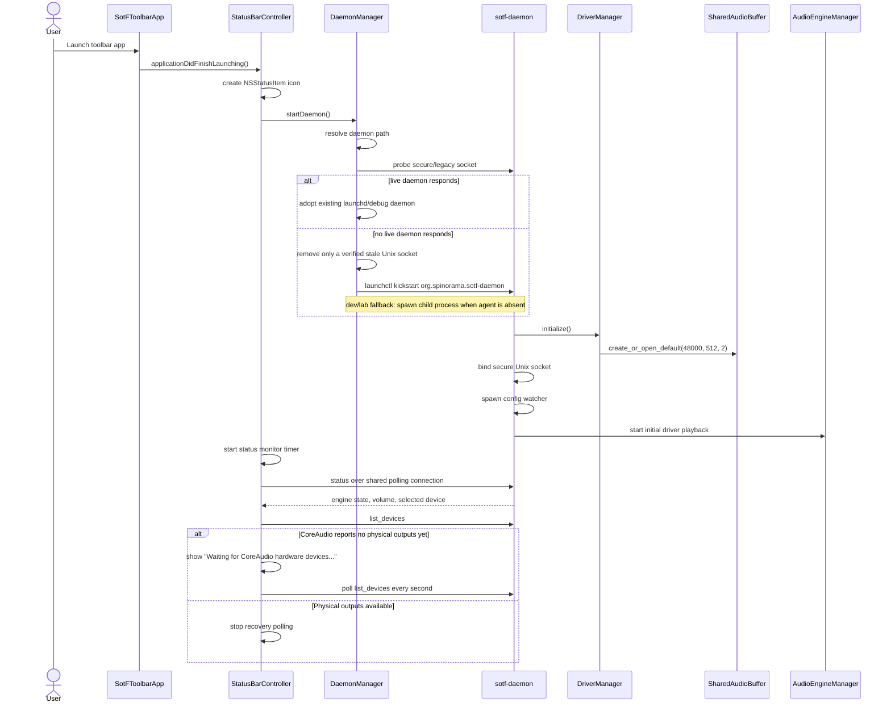

Key observations:

- Toolbar startup owns only processes it spawned; a live daemon found on the
  socket is adopted and left running. Adoption authenticates the peer as the
  same UID; like the runtime files, it treats processes under that UID as one
  trust domain and does not claim isolation from a malicious same-UID process.
- Daemon startup owns driver initialization and initial playback.
- Configbar status and metering polling run off the main thread through one
  serialized, reconnecting client connection. Mutations use a separate serial
  queue and roll back optimistic UI state on failure. Lifecycle adoption and
  watchdog checks use lock-independent `ping` rather than full `status`, so
  CoreAudio startup or pipeline replacement cannot trigger a false restart.
- Configbar sends an absolute plugin-artifact path in a small bounded IPC
  command; the daemon opens it without following symlinks and parses up to its
  64 MiB artifact bound off the UI thread. Pipeline mutations retain a
  thirty-second client deadline covering bounded startup and recovery without
  blocking AppKit.
- If CoreAudio is still recovering after install/restart, the toolbar treats an
  empty physical-output list as a transient recovery state and polls until
  hardware devices reappear.
- The menu bar icon is a status signal: startup/idle is explicitly dark,
  active playback is white, and errors are red.

- The driver watcher treats HAL capture resuming after at least thirty seconds
  idle as a physical-stream recovery boundary. It transactionally rebuilds the
  already-applied pipeline once, because a CoreAudio output stream can continue
  receiving callbacks while producing silence. Any explicit pipeline generation
  change resets the idle observation and prevents a redundant rebuild.
- Plugin-rack refreshes are coalesced while a daemon read is in flight. A stale
  generation rejection refreshes authoritative rack state and asks the user to
  retry; Configbar never replays an index-based mutation against a newer graph.

### Runtime ownership and recovery

The daemon creates or adopts a user-owned runtime directory, tightens existing
directory permissions to `0700`, and rejects foreign-owned non-sticky parents.
The explicit legacy socket exception is the system sticky directory only; the
legacy path is never unlinked as part of normal daemon cleanup. Startup locks
the canonicalized control socket, shared-memory transport, HAL key copy, and
private key before `AudioDaemon` construction or key rotation;
`bind_unix_socket` still re-checks stale entries. Configbar therefore does not
need to kill unrelated daemons or race a second bind, and split-path lab
configuration cannot create two owners for one transport.

Both mapped endpoints validate the backing file outside realtime callbacks.
Rust driver status clears observed capture/readiness when its mmap no longer
matches the published `audio.shm` inode. The Swift HAL maintenance queue maps a
replacement into an inactive slot and atomically publishes that generation
without waiting for long-lived CoreAudio clients to stop. Each callback pins
one slot for its complete operation; maintenance reuses an old slot only after
its callback-reader count reaches zero. This prevents an unlinked mmap from
reporting healthy transport while new readers attach to a different inode.

SIGINT and SIGTERM clear the daemon running flag. The shutdown path clears HAL
`engine_ready`, stops the engine, closes retained client sockets, joins every
client handler and the config watcher, and removes the daemon-owned socket after
revalidating that the entry is still a Unix socket.
When a pipeline transition fails after stopping the engine, the supervisor
restores the last applied plan where possible, explicitly re-requests that
plan's HAL input geometry, and exposes a recovery diagnostic in the next
status/snapshot response.

## Use Case: User Plays Music

There are two related "play" paths.

The file playback path is explicit:

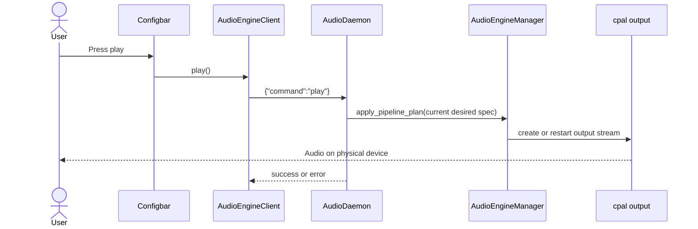

The systemwide path is usually active after startup or after `load_plugins`:

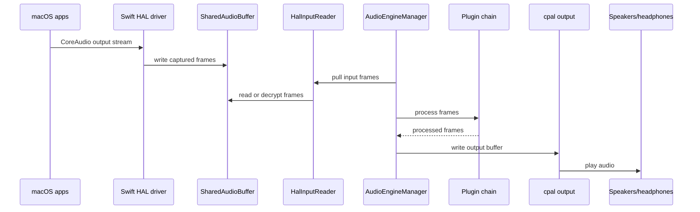

Key observations:

- The user-facing "play music" action may happen outside SOTF by playing audio
  in another macOS app.
- In systemwide mode, `engine_ready` in shared memory gates whether the HAL side
  should feed audio to the daemon. The daemon publishes it only after observing
  the first physical-output hardware callback; a startup error or twelve-second
  readiness deadline keeps it false and invokes pipeline recovery.
- While `engine_ready=true`, the daemon-owned `HalDriver` keeps
  `daemon_heartbeat_ms` fresh independently of audio reads. This avoids an
  idle-start deadlock where HAL accepts a later playback client but refuses to
  write frames because the daemon heartbeat expired before the first audio
  arrived.
- The following HAL-output plugin behavior describes a dormant alternative
  transport, not the active systemwide runtime. The daemon currently strips
  `hal_input` and `hal_output` nodes because capture uses `HalInputReader`
  directly and playback uses cpal.
- In that dormant HAL output plugin, readiness is the commit point of a transport
  transaction. Initialization and re-service quiesce once, discard stale
  pending output, flush the ring, and prime exactly the negotiated buffer-frame
  count before setting `engine_ready=true`. A short or otherwise invalid prime
  is rolled back by flushing the ring and retaining `engine_ready=false`.
- Compensable HAL output boundary latency is the fixed target ring fill plus
  the Swift virtual device's reported latency and safety offset. Typed v2
  telemetry exposes those components and the observed ring fill separately;
  ring capacity itself is not latency.
- Output device safety is enforced by rejecting virtual/loopback device names
  for the physical output side. When no hardware sink is selected, the engine
  scans for a physical output without opening the macOS default device first,
  because the default device is normally `SotF Virtual Audio` in systemwide
  mode. The daemon must not become a CoreAudio playback client of its own
  virtual capture device.

## Use Case: User Adds A Plugin

```mermaid
sequenceDiagram
    actor User
    participant Rack as PluginRackView
    participant Client as AudioEngineClient
    participant Daemon as AudioDaemon
    participant Pipeline as PipelineSupervisor
    participant Engine as AudioEngineManager

    User->>Rack: Choose plugin in AddPluginSheet
    Rack->>Client: addPlugin(type, parameters, nil)
    Client->>Daemon: {"command":"add_plugin", ...}
    Daemon->>Pipeline: clone desired plugins and prepare_plan()
    Pipeline-->>Daemon: PipelinePlan
    Note over Pipeline: sanitize user plugins + inject input/output loudness monitors
    Daemon->>Engine: update_plugin_chain(plan.runtime_plugins)
    alt Engine is running
        Engine-->>Daemon: hot update ok
        Daemon->>Pipeline: commit_applied(plan)
    else No engine running
        Daemon->>Engine: start_hal_playback_with_driver_config(...)
        Engine-->>Daemon: start ok
        Daemon->>Pipeline: commit_applied(plan)
    else Engine rejects transition
        Note over Daemon,Pipeline: no commit; desired/applied state unchanged
    end
    Daemon-->>Client: success or error
    Rack->>Client: getPlugins()
    Client->>Daemon: {"command":"get_plugins"}
    Daemon-->>Rack: user plugin list only
```

Key observations:

- The daemon is the source of truth for the desired user plugin list.
- The plugin rack keeps a local SwiftUI cache for rendering and editing.
- Metering plugins are derived system plugins, not user plugins.

## Use Case: User Rotates The Encryption Key

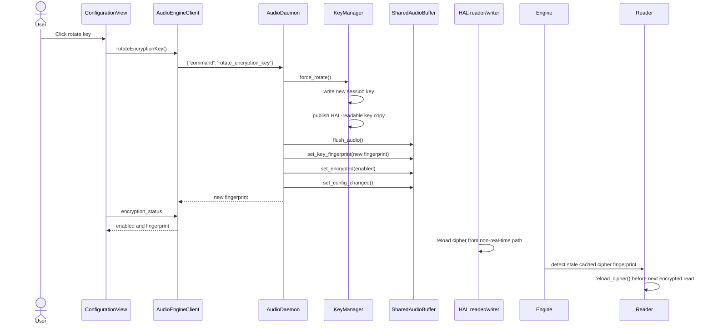

Key observations:

- `KeyManager` owns the session key.
- Shared memory publishes only transport metadata: encryption enabled flag and
  key fingerprint.
- HAL input/output readers cache ciphers and intentionally avoid filesystem I/O
  on audio callbacks.
- The daemon-side decoder checks `HalInputReader.needs_cipher_reload()` before
  reading encrypted HAL input. When the shared-memory fingerprint changes, it
  calls `reload_cipher()` from the decoder control path before `read()`, so key
  rotation or startup races do not strand the pipeline in a "playing but silent"
  state.
- If cipher reload fails, encrypted reads remain silent rather than emitting
  unauthenticated audio; retry is throttled to avoid filesystem work on the hot
  path. HAL regressions cover an on-disk/shared-memory fingerprint mismatch and
  require the stale cached cipher to be rejected.

## Use Case: Driver Reconfiguration

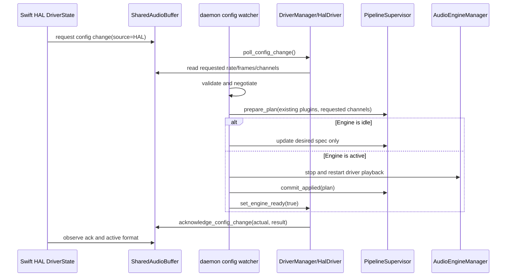

The reverse path also exists: daemon commands such as `set_sample_rate`,
`set_buffer_frames`, or `load_plugins` can call `DriverManager.request_config`,
which writes daemon-originated config requests into shared memory and waits for
the HAL side to acknowledge them.

Configbar uses `apply_configuration` when a user changes the physical output,
channel geometry, sample rate, or buffer size. The command patches the
daemon-owned desired state under the common pipeline mutation lock, validates
the complete requested format and output before teardown, and performs one
stop/configure/start/commit transition. Active output is muted with the engine
gain ramp around replacement. A failed apply restores the previous graph,
device, channel geometry, sample rate, and buffer size before releasing the
mute. Its error response carries the restored pipeline generation so the next
UI intent cannot reuse a stale concurrency token; failure of that restore
retains the existing explicit `restart_daemon` recovery state.

## Installation And Upgrade Lifecycle

The installer must assume an older systemwide version may already be active.
Replacing the app bundle or HAL driver while the toolbar, daemon, or CoreAudio
helper still hold runtime state can leave stale sockets, shared memory, or
session keys behind and can make the next launch appear healthy while no audio
flows.

The current package and standalone HAL installer lifecycle is:

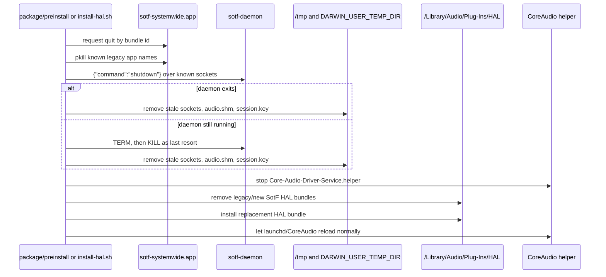

Important details:

- Daemon and Configbar are per-user LaunchAgents
  (`org.spinorama.sotf-daemon` and `org.spinorama.sotf-systemwide`). The
  preinstall script boots the agent out of the gui domain *before* quiescing
  the daemon; otherwise `KeepAlive` would respawn it mid-install and race the
  payload replacement. The app postinstall installs both freshly shipped
  plist templates from `/Library/Application Support/SotF` into
  `~/Library/LaunchAgents`, patches their absolute per-user log paths, and
  bootstraps the daemon for the console user. The final package component
  bootstraps and verifies Configbar after the HAL component completes.
- The installer does not rely on `launchctl kickstart` for `coreaudiod`; that
  is restricted on modern macOS.
- Runtime cleanup targets the secure daemon socket, legacy socket, `audio.shm`,
  and HAL-readable `session.key` copy.
- The toolbar should show a transient hardware-device recovery state after
  CoreAudio restarts instead of permanently selecting "no hardware devices".

## Architecture Improvement Proposals

### 1. Introduce A Single Daemon State Owner

`SystemwideController` is the daemon's runtime owner and serialized command
boundary. It owns the engine, driver, pipeline state, key manager, transition
lock, device registry, and snapshot construction; `AudioDaemon` remains a
compatibility name at the process/socket entry point. `PipelineSupervisor`
continues to reduce the audio-pipeline subset. Remaining work is to express
the controller's stop/configure/start operations as explicit effects rather
than adding new handler-specific orchestration:

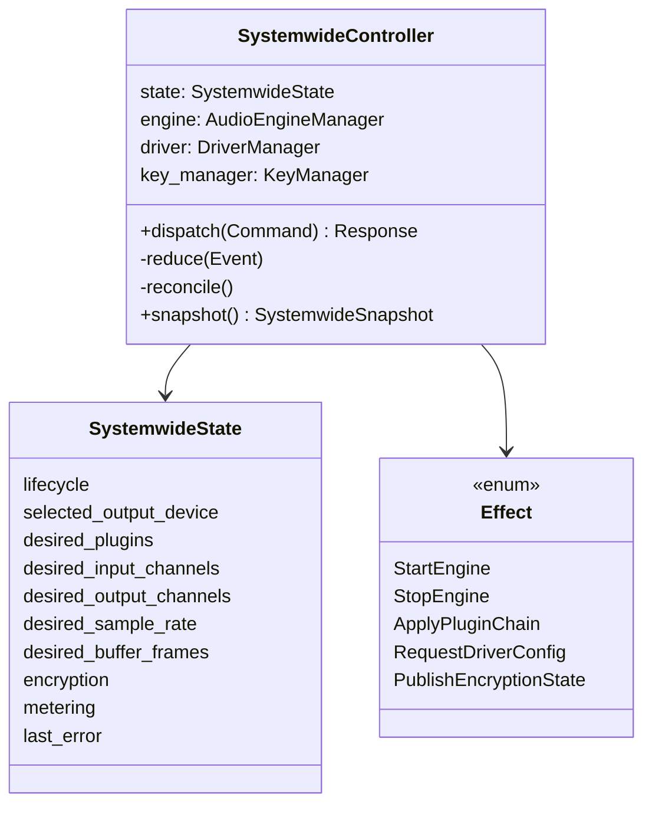

The controller would be the only writer of desired daemon state. IPC handlers
would become small command adapters:

1. Validate and authorize the command.
2. Convert the command into a domain event.
3. Let the controller update `SystemwideState`.
4. Let the controller run effects against the engine, driver, and shared memory.
5. Return a snapshot or command result.

The controller would replace the remaining effect-heavy command handlers with
one state owner and a smaller number of effect locks.

### 2. Separate Desired State From Observed Runtime State

Use two explicit data models:

| Model | Owner | Examples |
| --- | --- | --- |
| Desired state | Daemon controller | Selected output device, user plugin list, requested sample rate, requested channels, encryption enabled |
| Observed state | Runtime adapters | Actual engine state, driver readiness, HAL active format, underruns, metering values |

The daemon should publish one `SystemwideSnapshot` that combines both models for
the UI. The toolbar should render that snapshot rather than maintaining its own
parallel interpretation of the daemon state.

### 3. Make Derived State Non-Authoritative

These values should be recomputed from the canonical state whenever needed:

- Final runtime plugin chain with injected monitors.
- Input/output loudness monitor indices.
- Channel compatibility warnings.
- HAL `ready` booleans derived from status fields.

Derived values can be cached for performance, but the cache should have one
clear invalidation path and should never be separately user-editable.

### 4. Separate Linear Racks From DSP Graphs

The systemwide toolbar currently loads whole-chain plugin configs into the same
linear `load_plugins` command used by the rack. It accepts simple engine plugin
arrays, app-GPUI-style `plugins` arrays, and RoomEQ-style `global_plugins` plus
per-channel `channels`, but the RoomEQ shape is flattened into one linear list.
That is acceptable for rack-compatible chains, but it is not a faithful model
for complex DSP graphs with branches, buses, per-channel subgraphs, fan-in,
fan-out, or routing metadata.

Recommended rule:

- The rack is an editor for simple ordered plugin chains.
- Complex DSP exports should remain graph artifacts with explicit topology,
  channel roles, buses, routes, and render hints.
- The daemon accepts rack and engine-graph artifacts through
  `load_plugin_artifact` beside the compatibility `load_plugins` command.
- The toolbar can render an imported graph as a read-only graph summary or
  dedicated graph view instead of forcing it into a rack.
- Editing a graph should happen through graph-aware operations; editing it as a
  flattened rack should require an explicit destructive conversion.

Current implementation:

- `load_plugin_artifact` accepts rack-compatible artifacts: a top-level plugin
  array, `{ "plugins": [...] }`, or `{ "global_plugins": [...] }`.
- Artifacts with graph topology keys, routes, buses, nodes, edges, or
  per-channel `channels` are rejected as graph artifacts instead of flattened
  into the rack. This legacy statement applies only to higher-level
  per-channel RoomEQ artifacts that have not yet been converted to engine
  nodes/edges.
- Engine `PluginGraphConfig` artifacts now load with stable node IDs, explicit
  edges, per-node channel counts, parameters, and bypass state.
- Graph preparation validates IDs, endpoints, non-zero channels, acyclicity,
  and daemon-owned plugin boundaries before touching the engine.
- `PipelineSpec.user_graph` is mutually exclusive with `user_plugins`.
  Loudness monitors are injected only into the derived runtime graph.
- Active replacement uses the engine's prepare-then-swap update. Desired and
  applied state commit only after success, so invalid candidates preserve the
  previous graph and generation.
- Channel, output-device, and HAL reconfiguration preserve graph topology.
  Rack mutation commands reject graph mode rather than converting it.
- Configbar selects the existing rack or a graph editor with stable IDs,
  add/remove/reorder, connect/disconnect, settings, and host-level bypass.
- The linear rack row still exposes edit/remove without per-plugin bypass or
  channel controls, and graph reorder currently reloads the full artifact;
  these remain explicit UI/API follow-up items rather than hidden guarantees
  of the rack path.

### 5. Make Shared Memory A Transport, Not A State Store

`SharedAudioBuffer` is the correct owner of the cross-process memory protocol,
but it should not be treated as the product state owner. The daemon state should
own the desired config; shared memory should publish the protocol fields needed
by HAL and the daemon to exchange audio and acknowledgements.

Recommended rule:

- Daemon controller owns desired audio graph and driver configuration.
- HAL driver owns CoreAudio object lifecycle and current CoreAudio callback
  constraints.
- Shared memory owns only transport state: ring positions, format handshake
  fields, readiness flags, encryption fingerprint, and heartbeat.
- The daemon-side HAL adapter owns heartbeat publication. Audio reads may also
  refresh the heartbeat, but liveness must not depend on audio already flowing.

### 6. Replace Polling-Oriented UI With Snapshot Plus Events

The toolbar currently polls status and metering and separately refreshes plugins.
Keep polling where it is cheap and real-time enough for meters, but add a
single `get_snapshot` command for configuration state:

```json
{
  "command": "get_snapshot"
}
```

The response should include daemon lifecycle, selected output device, desired
plugins, available driver format, encryption status, and last errors. Later,
this can become a subscription/event stream over the same Unix socket.

### 7. Add Correlation IDs To Commands And Logs

Every command should carry or receive a generated `command_id`. The same ID
should appear in toolbar logs, daemon logs, driver config acknowledgements, and
state snapshots. This makes it possible to trace "user clicked add plugin" all
the way to "engine hot-updated plugin chain" without guessing from timestamps.

## Debugging Without Installing And Manual Testing

The current system is hard to validate because the full path normally requires:

1. Installing a HAL driver bundle in `/Library/Audio/Plug-Ins/HAL`.
2. Restarting or persuading CoreAudio to load it.
3. Running the toolbar.
4. Producing real system audio.
5. Inspecting behavior manually.

The architecture should support a local, scriptable "systemwide lab" instead.

### Proposed Debug Harness

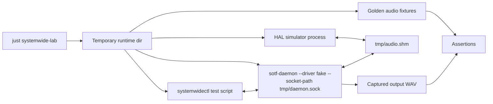

The harness should start all processes in a temporary directory and never write
to `/Library`, the real per-user daemon socket, or the real system audio output.

### Pieces To Add

| Piece | Purpose |
| --- | --- |
| `FakeAudioDriver` | Implements `AudioDriver` with deterministic sine/noise/multichannel fixtures and controllable config-change events. A first in-process fake driver now exists in daemon tests through `DriverManager::from_driver`. |
| HAL simulator | Opens `audio.shm`, writes/reads frames, toggles `driver_ready`, sends config changes, validates encryption fingerprints. Can be Rust or Swift command-line code. |
| `sotf-daemon --socket-path` | Lets tests bind to a temp socket instead of per-user or legacy paths. |
| `sotf-daemon --shared-memory-path` | Lets tests avoid `/tmp/sotf-{uid}/audio.shm`. |
| `sotf-daemon --no-autostart` | Starts IPC and driver status without starting initial playback, useful for command tests. |
| `systemwidectl` CLI | Sends JSON commands, waits for snapshots, dumps state, and records command/response traces. |
| `--capture-output path.wav` | Writes processed output to a file or in-memory sink instead of a physical cpal device. |
| Toolbar fake client tests | Run Swift UI/client logic against a fake Unix-socket daemon with golden responses. |
| Shared protocol tests | Keep Rust and Swift shared-memory header layouts, atomics, config handshakes, and encryption records in lockstep. |

### Recommended Test Pyramid

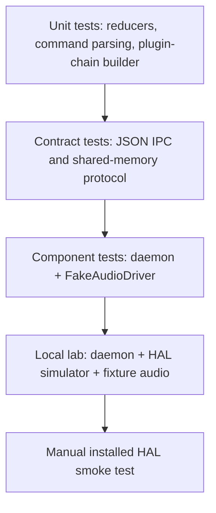

Manual installed-HAL testing should become the smallest layer. Most regressions
should be caught before a developer installs anything.

The current lab still cannot prove CoreAudio object lifecycle, device
ownership, actual audio callbacks, or bundle-resource loading without an
installed driver. Those remain release-validation gates even though the
daemon, IPC, shared-memory, and SwiftPM layers are covered by automated tests.

Current branch coverage starts the lower middle of that pyramid:

- `PipelineSupervisor` unit tests prove planning is pure, channel validation
  happens before mutation, and monitor indices are derived from the runtime
  chain.
- Fake-driver daemon tests prove `DriverManager` can be injected and driver
  status/config paths can be exercised without the installed HAL bundle.
- Unix-stream IPC tests send real JSON lines through `AudioDaemon::handle_client`
  and assert state is unchanged when an invalid channel-count transition is
  rejected.
- Snapshot IPC tests prove `get_snapshot` separates desired/observed state and
  exposes metering provenance; `dump_state` packages the snapshot with the user
  plugin list for doctor-style diagnostics.
- Reducer tests prove safe output-device adoption, virtual output-device
  rejection, and idle reconfiguration happen through `PipelineSupervisor`
  methods without committing an applied generation.
- Patch-intent tests prove channel changes preserve daemon-owned plugin and
  channel state instead of replaying stale UI payloads.
- Artifact-planning tests prove rack-compatible artifacts load and graph-shaped
  artifacts are rejected without flattening.
- Transport/metering snapshot tests prove `Playing` without frames/callbacks
  produces machine-readable fault codes, multiple active causes are not hidden
  by a single UI label, and fallback meters become diagnostics only while
  playback is active.
- Lab runtime hook tests prove daemon, toolbar, and HAL shared-memory paths can
  be isolated with environment variables, and `SOTF_SYSTEMWIDE_DRIVER=lab`
  provides deterministic fake capture without an installed HAL bundle.
- Toolbar intent tests prove channel apply uses the daemon patch command rather
  than replaying plugins, and whole-file plugin loading delegates artifact
  planning to the daemon.

`just systemwide-lab` is now an executable macOS gate. It creates and cleans a
unique `/private/tmp` runtime directory for each invocation. Its real daemon
subprocess scenarios use isolated Unix sockets and the lab driver to verify
coherent snapshots, 2 → 10 → 2 channel reconfiguration, transactional artifact
rejection with desired/applied state preservation, sample-rate and buffer-size
configuration with invalid-request rollback, encrypted-transport rejection and
key rotation, diagnostic dumps, shutdown, and clean restart. The daemon returns an
explicit capability error when a non-HAL build cannot provide a session cipher.
The same gate runs daemon state, Rust HAL protocol/streaming, and Configbar
model tests. The separate `just test-hal-driver-swift` gate launches a test-only
Rust transport worker while
Swift continuously reads, alternating 2/8 channels and 48/96 kHz through the
real cross-language quiesce/ack protocol.

### Scenario Matrix

The E2E lab should be scenario-driven. Each scenario should start from a clean
temporary runtime directory, send commands over the real JSON socket, simulate
driver/HAL behavior through fakes, and assert snapshots plus captured audio.

| Scenario | Simulation | Assertions |
| --- | --- | --- |
| Idle start then first playback | Start daemon, set `engine_ready=true`, wait longer than the HAL heartbeat timeout, then have the HAL simulator write sine frames | `daemon_heartbeat_ms` stays fresh, frames received/written increase, input/output meters become non-zero, no manual restart needed. |
| No writer frames | Daemon starts playback but fake HAL reports active without writing frames | Snapshot marks `observed.transport.input.status=input_frames_missing` and emits `input_frames_missing`; UI can display a transport fault instead of generic "No Audio". |
| Hardware output unavailable | Fake device inventory drops the selected device or returns no hardware outputs after startup | Desired selected device is preserved, observed output becomes unavailable, toolbar shows recovery/polling state, daemon never falls back to a virtual output. |
| Feedback-loop guard | Present `SotF Virtual Audio`, BlackHole, Loopback, and a hardware device; try selecting each as output sink | Virtual/loopback selections are rejected before engine restart; selected desired device remains the previous safe hardware device. |
| Channel-count negotiation | HAL simulator requests 2 -> 10 -> 2 input channels while an upmixer or matrix chain is loaded | Daemon desired input channels follow negotiated HAL input channels; toolbar adopts snapshot channels; stale UI apply cannot overwrite them. |
| Plugin load failure | Send invalid plugin/channel configs and graph-shaped configs that cannot be represented as a rack | Existing applied chain and metering indices remain unchanged; response explains whether the artifact is invalid or unsupported graph topology. |
| Complex DSP artifact | Load RoomEQ-style or graph-style artifact with branches/per-channel routes | Rack-compatible artifacts can be normalized; non-linear graphs are retained as graph artifacts or rejected without flattening silently. |
| Encryption rotation while playing | Enable encryption, stream known audio, rotate key, continue streaming | Published fingerprint changes, reader/writer reload from non-real-time paths, frame counters do not reuse `(key, nonce)`, meters recover without reinstall. |
| CoreAudio/helper restart | HAL simulator closes/reopens shared memory while daemon remains alive | Shared-memory geometry and readiness recover, desired daemon state is preserved, stale runtime transport state is not promoted to product state. |
| Meter analyzer unavailable | Engine runs but loudness plugin data is absent or plugin indices are stale | `get_metering` returns channel-shaped data plus provenance/status; `get_snapshot` emits `*_metering_unavailable` only while playback is active, so UI can distinguish zero signal from unavailable analyzer. |

Each scenario should record:

- Command trace with correlation IDs.
- Snapshots before and after every command.
- Driver/HAL simulator events and shared-memory header diffs.
- Audio fixture hashes or RMS/peak summaries.
- Expected UI-facing fault category.

The first milestone is not perfect audio fidelity; it is making contradictions
machine-detectable. A test should fail if the daemon says `Playing` while all
ingress frame counters remain zero for more than a bounded grace period, or if a
toolbar command can mutate daemon-owned channel/device state using stale local
values.

### Useful Debug Commands

Current automated contract/component gates:

| Command | Coverage |
| --- | --- |
| `just test-systemwide-macos` | Native Rust HAL/protocol/daemon tests, real local Unix-socket IPC, package-scoped strict Clippy, and Swift type-checks for the menu-bar client and HAL driver. |
| `just test-systemwide-linux-arm64` | Portable HAL streaming guards, protocol and daemon component/IPC tests, and package-scoped strict Clippy in a pinned native `linux/arm64` Docker image. |
| `just test-systemwide-macos-linux-arm64` | Runs the two gates sequentially, macOS first. |

These gates do not install the CoreAudio HAL bundle. `just systemwide-lab`
adds the isolated real-daemon scenarios described above, using a temporary
runtime directory and the deterministic lab driver. It covers the implemented
configuration, artifact, encryption, diagnostic, shutdown, client-drain, and
restart cases; the remaining device-loss, sleep/wake, helper-resurrection, and
captured-audio rows in the scenario matrix still require simulator coverage and
installed-system evidence. Manual lab launches must likewise use a temporary
`SOTF_SYSTEMWIDE_RUNTIME_DIR` to avoid the real per-user runtime.

| Variable | Effect |
| --- | --- |
| `SOTF_SYSTEMWIDE_RUNTIME_DIR` | Makes daemon, toolbar, and HAL code use one isolated directory. The daemon socket becomes `daemon.sock`, shared memory becomes `audio.shm`, the daemon-private key becomes `daemon-session.key`, and the HAL-readable copy becomes `session.key`. |
| `SOTF_DAEMON_SOCKET_PATH` | Overrides only the daemon control socket path. This wins over the runtime-dir socket path. |
| `SOTF_HAL_SHARED_MEMORY_PATH` | Overrides only the HAL shared-memory file path. This wins over the runtime-dir shared-memory path. |
| `SOTF_DAEMON_SESSION_KEY_PATH` | Overrides only the daemon-private encryption key path. This wins over the runtime-dir key path. |
| `SOTF_HAL_SESSION_KEY_PATH` | Overrides the HAL-readable session-key copy for both Rust and Swift HAL consumers. This wins over the runtime-dir key path. |
| `SOTF_SYSTEMWIDE_DRIVER=lab` or `fake` | Forces the daemon to use a deterministic in-process fake capture driver. It reports a ready 48 kHz stereo transport and emits a low-level sine signal once the engine marks the driver ready. |
| `SOTF_SYSTEMWIDE_DRIVER=null` | Forces the daemon to use `NullDriver`, useful for status/control tests that should not touch HAL or fake audio. |

Add a `systemwide doctor` or `systemwidectl doctor` command that collects:

- Secure and legacy socket paths.
- Daemon PID and version.
- Current `SystemwideSnapshot`.
- Driver status and active shared-memory header fields.
- Plugin chain and derived runtime chain.
- Last N command traces with correlation IDs.
- Last N daemon log lines.
- Whether the configured output device appears to be physical or virtual.

This gives a single bug-report artifact without requiring a live screen-share or
manual reproduction notes.

### No-Sound Diagnostic Checklist

When the user reports "music is progressing but no sound", diagnose the live
pipeline from the outside in before changing code:

1. Confirm CoreAudio can enumerate hardware devices:
   `system_profiler SPAudioDataType` should list at least one real output.
   If it returns no devices, the problem is below the toolbar/daemon layer.
2. Confirm the daemon is reachable on the secure socket and inspect `status`.
   The important fields are `state`, `selected_device`,
   `pipeline_applied_output_device`, `playback_output_device`,
   `playback_frames_received`, `playback_frames_written`,
   `playback_stream_error_count`, and `last_error`.
3. Confirm `list_devices` marks `SotF Virtual Audio` as the system default
   output while the daemon-selected output is a physical device.
4. Confirm `get_hal_config` reports `driver_installed=true`,
   `driver_ready=true`, `active=true`, and the expected sample rate, buffer
   size, and channel count.
5. Confirm `get_metering` has non-zero input/output peaks while music is
   playing. If status frames increase but metering is zero, the silence is
   before or inside the daemon processing path, not at the hardware sink.
6. Confirm encryption state and fingerprints. A stale HAL input cipher can make
   encrypted reads return silence while status still reports frames. The
   current decoder reloads stale ciphers before reading; if diagnosing an older
   install, temporarily sending `set_encryption=false` can distinguish key
   mismatch from routing or hardware problems.
7. Check recent logs for `org.spinorama.sotf-hal`, `coreaudiod`, and
   `sotf-daemon`, especially `SharedMemory state`, `Loaded encryption key`,
   `HAL input cipher reload failed`, and CoreAudio `IO_Sender` resync floods.

The 2026-05-27 live failure followed this pattern: `status` showed `Playing`,
ADAM Audio D3V selected, and frames received/written, but `get_metering` was
zero. Disabling encryption immediately restored non-zero meters, proving the
root cause was an encrypted HAL key/cipher mismatch rather than CoreAudio device
enumeration or output-device selection.

## Proposed Migration Plan

1. Add read-only `get_snapshot` and `dump_state` commands around the current
   implementation. Done for the daemon JSON IPC path.
2. Introduce `SystemwideState` plus reducer-style methods for every desired
   mutation; remove direct writes to `PipelineSupervisor.desired`. The daemon
   now owns a `SystemwideState` wrapper around the pipeline supervisor.
3. Convert IPC handlers to typed intents dispatched to a `SystemwideController`.
4. Extract plugin-chain/artifact planning into a pure module with unit tests,
   including explicit "rack chain" versus "graph artifact" outcomes. The first
   `plugin_artifact` planner is in place for `load_plugin_artifact`.
5. Make metering and transport faults first-class snapshot fields rather than
   inferred UI labels. Done in the daemon snapshot through
   `observed.transport` and `diagnostics.faults`.
6. Add `FakeAudioDriver`, HAL simulator, temp socket/shared-memory path
   overrides, and output capture. The first runtime hooks are in place:
   isolated socket/shared-memory paths plus an in-process lab driver. A HAL
   simulator process and output capture still need to be added.
7. Run the existing `just systemwide-lab` gate in macOS CI without installing
   the HAL bundle, and keep `just test-hal-driver-swift` as an explicit adjacent
   cross-language gate.
8. Finish removing residual toolbar polling. Configbar already renders the
   coherent `get_snapshot` response and sends typed channel/plugin intents;
   remaining compatibility probes must not reconstruct diagnostic state from
   legacy `status`. That endpoint is explicitly a best-effort view.

## Invariants To Preserve

- No filesystem I/O, allocations, or logging-heavy work on CoreAudio real-time
  callbacks.
- The daemon must never choose or transiently open the SOTF virtual device,
  BlackHole, Loopback, Soundflower, or similar virtual devices as the physical
  output sink.
- Cross-process shared-memory fields must remain atomic and versioned.
- Encryption key rotation must not reuse `(key, frame_counter)` pairs.
- Encryption key changes must not require manual reinstall/restart recovery;
  stale cached ciphers must be detected and reloaded from non-real-time paths.
- The daemon must maintain lock ordering or remove the need for multi-lock
  operations through a single controller.
- No component may mutate another component's desired state by replaying a
  cached copy. Commands either patch one field or submit a complete artifact
  with an explicit generation/base snapshot.
- A state transition that changes graph, channel count, output sink, HAL
  readiness, or encryption must produce one observable snapshot delta and one
  command trace entry.
- `Playing` with no input frames, no output callbacks, stale heartbeat, missing
  hardware output, or unavailable metering analyzer must be represented as
  distinct diagnostic states.
- `_coreaudiod` must remain restricted to the minimum command set.
- `ARCHITECTURE.md` must be updated alongside README/changelog changes whenever
  architecture, operational behavior, debugging strategy, or state ownership
  changes.

## Summary

The existing architecture has a sensible boundary between toolbar, daemon,
driver abstraction, HAL bridge, and audio engine. The main improvement is not to
split it into more services; it is to make the daemon's desired state explicit
and singly owned. Once the daemon can expose a coherent snapshot and run against
fake drivers/transports, most systemwide behavior can be debugged and tested
locally without installing the HAL driver or relying on manual audio tests.
